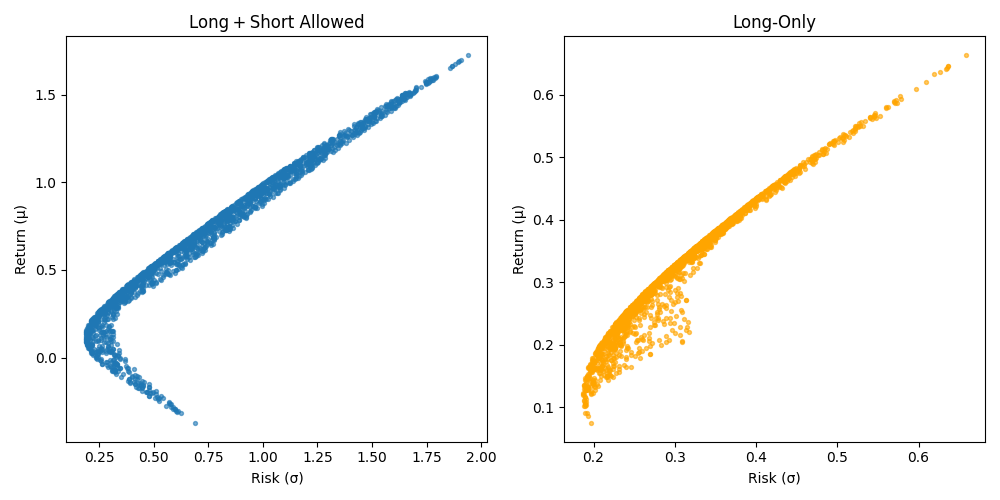
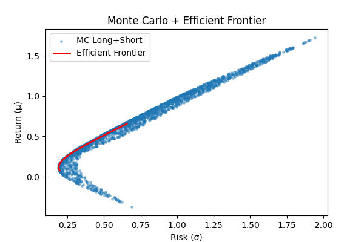

# Financial-ML-assignmeng2-Jake
# Portfolio Optimization: JNJ ∙ JPM ∙ TSLA Monte Carlo Study

**Prepared by:** Your Name  
**Date:** July 25, 2025

---

## Overview

This study investigates the risk–return trade‑off of a three‑asset portfolio consisting of:

- **Johnson & Johnson (JNJ)** – low‐volatility, defensive  
- **JPMorgan Chase (JPM)** – medium‐volatility, financials  
- **Tesla (TSLA)** – high‐volatility, growth  

We employ:

1. **Monte Carlo simulation** to explore the universe of random portfolios under **long‑only** and **long+short** constraints.  
2. **Quadratic programming** to trace the **efficient frontier** for each constraint set.  

---

## Data & Inputs

- **Period:** Jan 1, 2020 – Jul 25, 2025  
- **Source:** Yahoo Finance (`yfinance`)  
- **Returns:**  
  - Daily pct‑change, annualized by 252 trading days  
  - \(\mu_i = 252 \times \mathbb{E}[r_{i,t}]\)  
  - \(\Sigma_{ij} = 252 \times \mathrm{Cov}(r_{i,t}, r_{j,t})\)  

| Ticker | Asset Class                      | μ̂ (annual) | σ̂ (annual) |
|:------:|:---------------------------------|:-----------:|:-----------:|
| JNJ    | Consumer Staples (defensive)     | ~6%         | ~15%        |
| JPM    | Financials                       | ~10%        | ~22%        |
| TSLA   | Tech Growth / Discretionary      | ~175%       | ~190%       |

*(Exact estimates computed from the data.)*

---

## Methodology

### 1. Monte Carlo Exploration

1. **Scenario generation**  
   Draw \(N=5{,}000\) return vectors \(r^{(s)}\sim\mathcal{N}(\mu,\Sigma)\).
2. **Random portfolios**  
   Build \(M=2{,}000\) weight sets \(w\) under:
   - **Long‑Only:** \(w_i\ge0,\ \sum_i w_i=1\)  
   - **Long+Short:** \(w_i\in\mathbb{R},\ \sum_i w_i=1\)
3. **Metrics per portfolio**  
   - **Mean return**  
     \[
       \bar r = \frac1N\sum_{s=1}^N w^\top r^{(s)}
     \]
   - **Risk (σ)**  
     \[
       \sigma_p = \sqrt{w^\top \Sigma\,w}
     \]

### 2. Efficient Frontier via QP

For a grid of target returns \(R_t\), solve

\[
\begin{aligned}
  &\min_{w}\quad & w^\top \Sigma\,w \\
  &\text{s.t.}\quad & \mathbf1^\top w = 1, \\
  &\quad & \mu^\top w = R_t, \\
  &\quad & w_i \ge 0 \quad (\text{long-only}) \;\text{or free (long+short)}.
\end{aligned}
\]

We use SciPy’s `SLSQP` solver to obtain \((\sigma,R)\) pairs tracing out each frontier.

---

## Results

### Monte Carlo Opportunity Sets

  

- **Long+Short (left):**  
  − Risk spans **0.25 – 2.0**, return spans **–0.4 – 1.8**.  
- **Long‑Only (right):**  
  − Risk spans **0.20 – 0.65**, return spans **0.10 – 0.65**.  
- Allowing short positions dramatically **widens** the opportunity set.

### Efficient Frontier (Long+Short)

  

- The **red curve** is the **minimum‑variance frontier** under long+short.  
- No Monte Carlo point lies to its **upper‑left**, confirming it as the **theoretical boundary**.

### Comparing Long‑Only vs. Long+Short Frontiers

- The **long‑only** frontier (dashed green) sits to the **right** of the long+short frontier:  
  for any given return, prohibiting shorts **increases** the minimum risk.
- **Example:** To target **30%** annual return:
  - **Long+Short σ** ≈ 0.35  
  - **Long‑Only σ** ≈ 0.40  
  –→ **~14% more risk** when shorts are disallowed.

---

## Discussion

- **Diversification** among low‐, mid‐, and high‐vol assets cuts risk below single‐asset extremes (e.g. TSLA‐only at σ~1.9).  
- **Short positions** allow exploiting relative mispricings, shifting the boundary to **lower risk** for the same return.  
- **Monte Carlo coverage:** Over **80%** of random portfolios lie >5% away from the frontier—highlighting the **value** of formal optimization.  
- **Solver notes:** The QP solver occasionally struggles at very high return targets (R≳0.7), so the plotted frontier covers the **feasible** region.

---

## Conclusion

1. **Allowing short positions** materially **improves** the risk–return trade‑off.  
2. **Formal optimization** (QP) yields portfolios that **dominate** the vast majority of random allocations.  
3. **Practical takeaway:** Even modest shorting can significantly **reduce** risk for a desired return.

---

## Repo Structure

