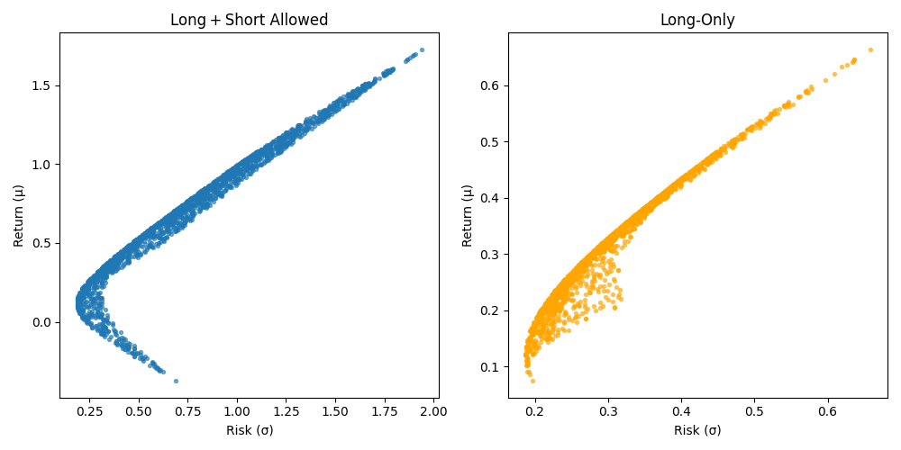
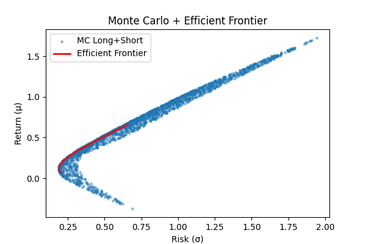

# Portfolio Optimization Study: JNJ · JPM · TSLA

Hongduo,SHAN\
**Date:** July 17, 2025

---
## Summary
This study examines the risk–return trade‑off of a three‑asset portfolio (JNJ, JPM, TSLA) by combining Monte Carlo simulation and quadratic programming. We simulated 5 000 annual return scenarios, generated 2 000 random portfolios under long‑only and long + short regimes, and computed their sample mean returns and risks to visualize opportunity sets. We then solved a constrained quadratic program to trace the precise efficient frontier in each regime. The results highlight how short positions widen the feasible set and shift the frontier toward lower risk for a given return, underscoring the value of formal optimization in portfolio construction.

---

## Definitions

- **Monte Carlo Simulation:** Repeated random sampling to estimate the behavior of a system—in this case, portfolio returns drawn from a multivariate normal distribution.  
- **Annualized Return (μᵢ):** The expected yearly return of asset _i_, computed as mean daily return × 252.  
- **Covariance Matrix (Σ):** Matrix of covariances Σᵢⱼ = Cov(rᵢ, rⱼ), used to compute portfolio variance.  
- **Portfolio Return (𝑟̄):** Weighted average of asset returns  
- **Portfolio Risk (σₚ):** Standard deviation of portfolio returns
- **Quadratic Programming (QP):** Optimization of a quadratic objective with linear constraints.  
- **Efficient Frontier:** Set of portfolios offering maximum return for a given risk (or minimum risk for a given return).  
- **Long‑Only:** Constraint wᵢ ≥ 0 (no shorts).  
- **Long + Short:** wᵢ unconstrained with only ∑ᵢ wᵢ = 1.

---

## Introduction & Overview

This project analyzes the risk–return trade‑off of a three‑asset portfolio comprising:

- **Johnson & Johnson (JNJ)** — defensive, low volatility
- **JPMorgan Chase (JPM)** — cyclical, medium volatility
- **Tesla (TSLA)** — growth, high volatility

We use two complementary approaches:

1. **Monte Carlo Simulation** — generate random portfolios under long‑only and long + short constraints to visualize the opportunity set.
2. **Quadratic Programming** — compute the precise efficient frontier for each constraint regime.

The Results highlight how allowing short positions shifts the frontier and reduces portfolio risk for a given return.

---

## Data & Inputs

- **Period:** 2020‑01‑01 through 2025‑07‑25
- **Data source:** Yahoo Finance via `yfinance`
- **Assets:** JNJ, JPM, TSLA (daily adjusted prices)

Annualized estimates:

| Ticker | Description                    | Mean μ (annual) | Volatility σ (annual) |
| ------ | ------------------------------ | --------------- | --------------------- |
| JNJ    | Consumer Staples (defensive)   | \~6%            | \~15%                 |
| JPM    | Financials                     | \~10%           | \~22%                 |
| TSLA   | Auto / Tech Growth (high beta) | \~175%          | \~190%                |

*Exact μ and σ are computed from daily returns and scaled by 252 trading days.*

---

## Methodology

### 1. Monte Carlo Simulation

1. **Estimate μ and Σ** from historical daily returns:
   - μᵢ = 252 × E[r\_{i,t}]
   - Σ = 252 × Cov(r)
2. **Generate N = 5 000** synthetic annual return scenarios: r^(s) ∼ 𝒩(μ, Σ).
3. **Draw M = 2 000** random weight vectors w under two regimes:
   - **Long‑only:** wᵢ ≥ 0; ∑ᵢ wᵢ = 1
   - **Long + Short:** w unconstrained; ∑ᵢ wᵢ = 1
4. **Compute** for each portfolio:
   - **Expected return:**\
     \(\bar r = \frac{1}{N} \sum_{s=1}^N w^T r^{(s)}\)
   - **Risk (σ):**\
     \(σ_p = \sqrt{w^T Σ w}\)
5. **Plot** risk vs. return to visualize the opportunity sets.

### 2. Efficient Frontier

For each target return R\_t on a grid, solve:

$$
\begin{aligned}
&\min_w \quad w^T Σ w \\
&\text{s.t.} \quad \mathbf{1}^T w = 1, \quad μ^T w = R_t, \\
&\quad w_i \ge 0 \quad (\text{long‐only}) \;\text{or free (long+short)}.
\end{aligned}
$$

Use SciPy’s SLSQP solver to obtain the minimum‐variance σ for each R\_t, tracing the frontier.

---

## Results

### Opportunity Sets

- **Left (Long + Short):** Risk 0.25–2.0, Return –0.4–1.8.
- **Right (Long‑Only):** Risk 0.20–0.65, Return 0.10–0.65.
- Allowing shorts **widens** the feasible set substantially.

  

…

  

### Efficient Frontiers

- **Red:** Long + Short frontier
- **Green dashed:** Long‑only frontier
- Shorts shift the frontier **left**, lowering risk for the same return.

**Illustrative point:** For R\_t = 30%:

- σ\_{LS} ≈ 0.35
- σ\_{LO} ≈ 0.40\
  → **\~14%** risk reduction when shorts are allowed.

---

## Discussion

- **Diversification benefit:** Combining low‑, medium‑, and high‑vol assets yields portfolios with lower risk than single‐asset positions.
- **Impact of shorting:** Permitting short positions unlocks additional return streams, compressing the frontier toward lower risk.
- **Monte Carlo vs. QP:** Most random portfolios lie >5% away from the frontier, underscoring the importance of formal optimization.
- **Solver behavior:** At very high return targets (R > 0.7), the QP occasionally fails to converge—our frontier reflects the feasible region.

---

## Conclusion

- **Short positions** meaningfully **improve** risk–return trade‑offs.
- **Quadratic programming** identifies portfolios that dominate the bulk of random allocations.
- **Practical recommendation:** Even modest short exposure can substantively reduce portfolio risk.

---

